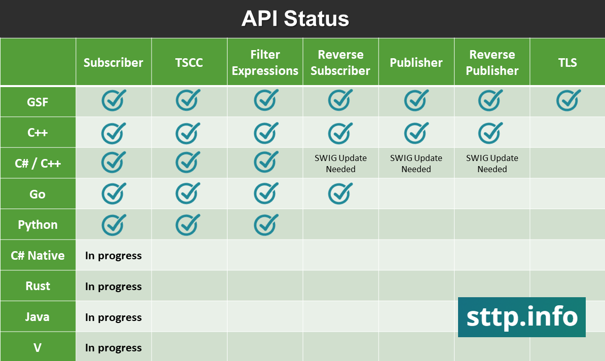

The Streaming Telemetry Transport Protocol (STTP) is optimized for the demands of transporting high volume continuous streaming data and related metadata.
The protocol allows for the transmission of any information that can be represented longitudinally, e.g., time-series data.

STTP is an approved satndard, IEEE 2664-2024, see: https://standards.ieee.org/ieee/2664/7397/

This GitHub organizational site defines open source langauge specific implementations of STTP for general industry use.

See https://sttp.info/ for general STTP documentation.

